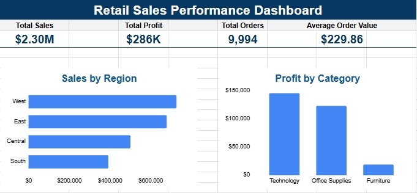

# Retail Sales Performance Analysis

## Goal

To evaluate retail sales performance and identify trends across regions, product categories, and customers using Google Sheets, pivot table analysis, KPI reporting, and dashboard visualization.

---

## Dataset

The dataset contains 9,994 retail sales transactions and includes:
- Order information
- Customer information
- Product categories
- Sales revenue
- Discounts
- Profit metrics

The objective was to identify key performance indicators (KPIs) and uncover actionable business insights from the data.

---

## Step 1: Data Review

The dataset was imported into Google Sheets and reviewed to understand the available dimensions and metrics.

Key fields analyzed included:

- Order Date
- Customer Name
- Region
- Category
- Product Name
- Sales
- Quantity
- Discount
- Profit

### Objective

Determine which metrics could be used to measure overall business performance and identify trends across customers, products, and regions.

---

## Step 2: KPI Development

Create KPI calculations in Google Sheets to evaluate overall business performance.

### KPIs

| Metric | Value |
|----------|----------|
| Total Sales | $2.30M |
| Total Profit | $286K |
| Total Orders | 9,994 |
| Average Order Value | $229.86 |

### Findings

The business generated more than $2.3 million in sales revenue across nearly 10,000 transactions while producing approximately $286,000 in profit.

---

## Step 3: Regional Analysis

A Pivot Table was created to aggregate sales performance across geographic regions.

### Sales by Region

salesbyregion.png

### Findings

- West generated the highest sales revenue ($725K)
- East generated the second-highest sales revenue ($679K)
- Central generated $501K in sales revenue
- South generated the lowest sales revenue ($329K)

### Insight

Regional sales performance varied significantly, suggesting opportunities for targeted growth initiatives in lower-performing markets.

---

## Step 4: Product Category Profitability Analysis

A Pivot Table was created to compare profitability across product categories.

### Profit by Category

INSERT PROFIT BY CATEGORY PNG

### Findings

| Category | Profit |
|----------|----------:|
| Technology | $145K |
| Office Supplies | $122K |
| Furniture | $18K |

### Insight

Technology generated the highest profit, while Furniture significantly underperformed relative to the other categories. This suggests opportunities to improve profitability within the Furniture category through pricing, product mix, or cost management strategies.

---

## Step 5: Customer Analysis

Customer sales performance was analyzed to identify the highest-value customers. 

INSERT TOP CUSTOMERS PNG

### Top Customers

1. Sean Miller ($25,043)
2. Tamara Chand ($19,052)
3. Raymond Buch ($15,117)
4. Tom Ashbrook ($14,596)
5. Adrian Barton ($14,474)

### Insight

Revenue was concentrated among a relatively small number of high-value customers, highlighting the importance of customer retention and account management strategies.

---

## Step 6: Dashboard Development

A dashboard was developed to consolidate KPI metrics and key business insights into a single reporting view.

### Dashboard

The dashboard includes:

- KPI reporting
- Regional sales analysis
- Category profitability analysis
- Customer performnace insights

---

## Key Business Insights

- The West region generated the strongest sales performance ($725K).
- Technology produced the highest profit ($145K).
- Furniture generated significantly lower profits than competing product categories.
- A small group of customers accounted for a disproportionate share of revenue.
- KPI reporting provided visibility into organizational performance across sales, profitability, and customer activity.

---

## Skills Demonstrated

- Data Analysis
- Exploratory Data Analysis (EDA)
- Pivot Tables
- KPI Reporting
- Dashboard Design
- Business Intelligence
- Data Visualization
- Data Storytelling

---

## Tools Used

- Google Sheets
- Pivot Tables
- Dashboard Visualization

---

## Project Outcome

This project demonstrated the ability to transform raw transactional data into actionable business insights through analysis, visualization, and reporting. By leveraging Google Sheets and pivot table analysis, key trends in regional sales performance, product profitability, and customer behavior were identified and communicated through an executive dashboard.
